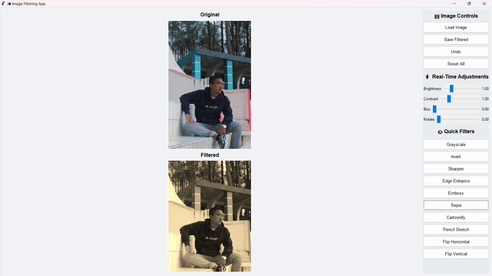

# Image Filtering App  

## Description  
The **Image Filtering App** is a Python-based GUI application (Tkinter + Pillow) designed to load images, apply filters, adjust them in real-time, and save the filtered results.  

## Key Features  
- **Load Image**: Import an image from your computer  
- **Save Filtered**: Save the filtered image result  
- **Undo**: Revert to the previous state  
- **Reset All**: Restore the original image  
- **Real-time adjustments**: Brightness, Contrast, Blur, Rotate  
- **Quick Filters**: Grayscale, Invert, Sharpen, Edge Enhance, Emboss, Sepia, Cartoonify, Pencil Sketch, Flip Horizontal/Vertical  

## How to Use  
1. Click **Load Image** to select an image.  
2. Use the sliders to adjust image properties in real-time.  
3. Click the filter buttons to apply effects.  
4. Use **Undo** to revert to the previous state.  
5. Click **Save Filtered** to save the final result.  
6. Use **Reset All** to restore the original image.  

## Requirements  
- Python 3.8 or newer  
- Libraries:  
  - `tkinter`  
  - `Pillow`  

## Preview  
Here’s a quick look at the application interface:  

  

## Notes  
This application supports JPG, PNG, JPEG, and BMP image formats.  
